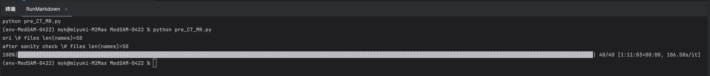

# MedSAM-0422

ref https://github.com/bowang-lab/MedSAM

---

This is the official repository for MedSAM: Segment Anything in Medical Images.
（self 2024 0422）

## News

- 2024.01.15: Welcome to join [CVPR 2024 Challenge: MedSAM on Laptop](https://www.codabench.org/competitions/1847/)
- 2024.01.15: Release [LiteMedSAM](https://github.com/bowang-lab/MedSAM/blob/LiteMedSAM/README.md) and [3D Slicer Plugin](https://github.com/bowang-lab/MedSAMSlicer), 10x faster than MedSAM! 

## Installation
1. Create a virtual environment `env-MedSAM-0422`, python=3.10
2. run`pip3 install torch torchvision torchaudio`
3. git clone
4. enter folder
5. run `pip install -e .`

## Get Started
Download the [model checkpoint](https://drive.google.com/drive/folders/1ETWmi4AiniJeWOt6HAsYgTjYv_fkgzoN?usp=drive_link) and place it at e.g., `work_dir/MedSAM/medsam_vit_b`

We provide three ways to quickly test the model on your images

1. Command line（未验证）

```bash
python MedSAM_Inference.py # segment the demo image
```

Segment other images with the following flags
```bash
-i input_img
-o output path
--box bounding box of the segmentation target
```

2. Jupyter-notebook

2.1. We provide a step-by-step tutorial on [CoLab](https://colab.research.google.com/drive/19WNtRMbpsxeqimBlmJwtd1dzpaIvK2FZ?usp=sharing)

真的直接运行就行，不需要任何移动

2.2. You can also run it locally with `tutorial_quickstart-0422.ipynb`.

运行后，`medsam_vit_b.pth`会在ipynb同一目录下。

试图展示原来的照片，但是发现没区别。


3. GUI（未验证）

Install `PyQt5` with [pip](https://pypi.org/project/PyQt5/): `pip install PyQt5 ` or [conda](https://anaconda.org/anaconda/pyqt): `conda install -c anaconda pyqt`

```bash
python gui.py
```

Load the image to the GUI and specify segmentation targets by drawing bounding boxes.


## Model Training

### Data preprocessing

1. Download [SAM checkpoint](https://dl.fbaipublicfiles.com/segment_anything/sam_vit_b_01ec64.pth) and place it at `work_dir/SAM/sam_vit_b_01ec64.pth` .

2. Download the demo [dataset](https://zenodo.org/record/7860267) and unzip it to `data/FLARE22Train/`.

This dataset contains 50 abdomen CT scans and each scan contains an annotation mask with 13 organs. The names of the organ label are available at [MICCAI FLARE2022](https://flare22.grand-challenge.org/).

3. Run pre-processing

Install `cc3d`: `pip install connected-components-3d`

```bash
python pre_CT_MR.py
```

- split dataset: 80% for training and 20% for testing
- adjust CT scans to [soft tissue](https://radiopaedia.org/articles/windowing-ct) window level (40) and width (400)
- max-min normalization
- resample image size to `1024x2014`
- save the pre-processed images and labels as `npy` files

运行后有95.69GB。


### Training on multiple GPUs (Recommend)

The model was trained on five A100 nodes and each node has four GPUs (80G) (20 A100 GPUs in total). Please use the slurm script to start the training process.

```bash
sbatch train_multi_gpus.sh
```

When the training process is done, please convert the checkpoint to SAM's format for convenient inference.

```bash
python utils/ckpt_convert.py # Please set the corresponding checkpoint path first
```

### Training on one GPU

```bash
python train_one_gpu.py
```

If you only want to train the mask decoder, please check the tutorial on the [0.1 branch](https://github.com/bowang-lab/MedSAM/tree/0.1).


## Acknowledgements
- We highly appreciate all the challenge organizers and dataset owners for providing the public dataset to the community.
- We thank Meta AI for making the source code of [segment anything](https://github.com/facebookresearch/segment-anything) publicly available.
- We also thank Alexandre Bonnet for sharing this great [blog](https://encord.com/blog/learn-how-to-fine-tune-the-segment-anything-model-sam/)


## Reference

```
@article{MedSAM,
  title={Segment Anything in Medical Images},
  author={Ma, Jun and He, Yuting and Li, Feifei and Han, Lin and You, Chenyu and Wang, Bo},
  journal={Nature Communications},
  volume={15},
  pages={1--9},
  year={2024}
}
```
